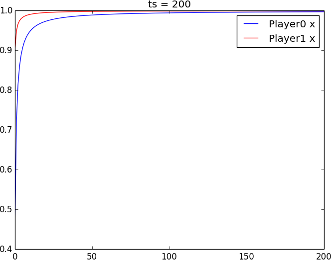

Fictitious Play
========

<h2>
プログラムの出力結果  
</h2>

<h3>Matching Pennies：</h3>  
　　

 
 

<h3>調整ゲーム:</h3> 
　　

 
 

[背景とコードの説明](https://docs.google.com/viewer?url=https://github.com/Naoya-Sho/fic-play/blob/master/Fictitiousplay_slides.pdf?raw=true)